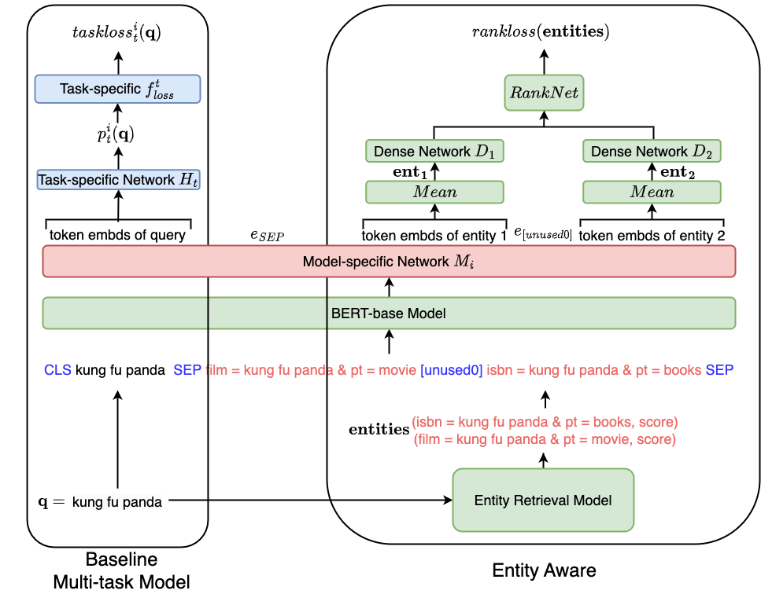

<div align="center">

# [EAMT]()

</div>

# What is it?
This repo contains multi-task models: MTDNN, MMoE and PLE as well as their corresponding EAMT versions: EAMT_MTDNN, EAMT_MMoE, and EAMT_PLE. EAMT models are built on basic multi-task models as shown in the following figure:

<div align="center">

</div>

## Walmart Privacy Requirements

Due to Walmart Privacy Requirements, some code are deleted and datasets are not open to public. We have elaborated the details of each model in section 3, and you can implement the missing code by yourself. 

## How to run

Install dependencies

```bash
# clone project
git clone https://github.com/zhiyuanpeng/KDD2023-EAMT
cd KDD2023-EAMT

# install python 3.8 env
python -m venv venv
source ./venv/bin/activate
pip install -r requirements.txt
pip install torch==1.11.0+cu113 torchvision==0.12.0+cu113 torchaudio==0.11.0 --extra-index-url https://download.pytorch.org/whl/cu113
```

[template](https://github.com/ashleve/lightning-hydra-template) is applied for all the models. Please check the repo of the template for more details about how to run the models from experiment configuration. Here are some examples:

Train model with chosen experiment configuration from [configs/experiment/](configs/experiment/)

```bash
cd EAMT_MTDNN
python train.py experiment=mtdnn-entity/f-listnet_eng_nn/4task_gm_ivf_0.99_onnx_export
```

You can override any parameter from command line like this

```bash
python train.py trainer.max_epochs=20 datamodule.batch_size=64
```

# Experiment Configuration
The experiment configuration files are stores in `configs/experiment/` under each model folder.

## EAMT_MMoE
```
# on small dataset
configs/experiment/mmoe/s/4task_gm_e4l1.yaml
...
configs/experiment/mmoe/s/4task_gm_e16l2.yaml
```
## EAMT_MTDNN
```
# on big dataset
configs/experiment/mtdnn-entity/f-listnet_eng_nn/4task_gm_ivf_0.99.yaml
# on small dataset
configs/experiment/mtdnn-entity/s-m-listnet_eng_nn/4task_gm_ivf_0.99_lmdb.yaml
```
## EAMT_PLE
```
# on small dataset
configs/experiment/ple/s/4task_gm_e4l1.yaml
...
configs/experiment/ple/s/4task_gm_e16l2.yaml
```
## MMoE
```
# on small dataset
configs/experiment/mmoe/s/4task_gm_e4l1.yaml
...
configs/experiment/mmoe/s/4task_gm_e16l2.yaml
```
## MTDNN
```
# on big dataset
configs/experiment/mtdnn/f/4task_gm.yaml
# on small dataset
configs/experiment/mtdnn/s/4task_gm.yaml
```
## PLE
```
# on small dataset
configs/experiment/ple/s/4task_gm_e4l1.yaml
...
configs/experiment/ple/s/4task_gm_e16l2.yaml
```


